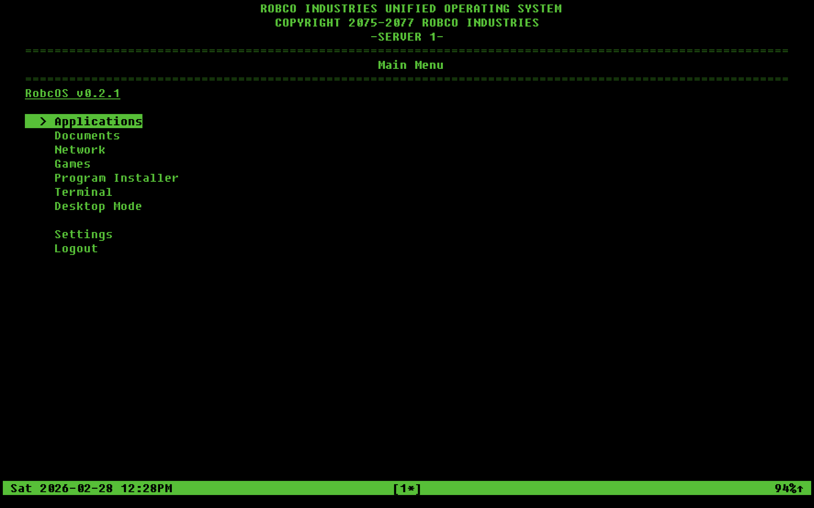
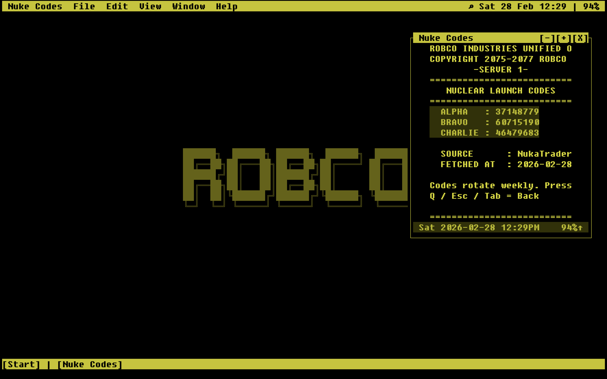

# RobCoOS (Rust)

Fallout-style terminal environment built with Rust, ratatui, and crossterm.

RobCoOS is an application-layer shell experience, not a full standalone operating system.




## Version

`0.3.1`

## Highlights

- Multi-user login with per-user settings and per-user app/menu data.
- Up to 9 sessions with hot-switching (menu and PTY-aware switching).
- Terminal-mode main menu: Applications, Documents, Network, Games, Program Installer, Terminal, Desktop Mode, Settings.
- Desktop Mode with:
  - top status bar + spotlight icon
  - taskbar + Start menu
  - draggable/resizable windows
  - minimize/maximize/close controls
  - draggable desktop icons (`My Computer`, `Trash`) with persisted positions
- Built-in app: `Nuke Codes` (visibility toggle in Edit Applications).
- Default Apps system (terminal + desktop settings):
  - separate defaults for Text/Code and Ebook files
  - supports built-in ROBCO Terminal Writer, menu entries, and custom argv JSON
  - per-user settings
  - first-login prompt for new users
- Document routing with explicit error when no app is configured:
  - `Error: No App for filetype`

## Requirements

- Rust stable toolchain (`cargo`, `rustc`)
- `curl` (required preflight dependency)
- Optional external tools:
  - `epy`
  - `vim`
  - other CLI apps you add to menus
- Optional audio backend:
  - `python3`
  - Python module `playsound`

Platform audio fallbacks:

- macOS: `afplay`
- Linux: `aplay` or `paplay`
- Windows: PowerShell `Media.SoundPlayer`

## Build

```bash
cargo build
```

Release build:

```bash
cargo build --release
```

Tagged GitHub releases package platform-specific artifacts:

- macOS: `RobCoOS.app` inside the release zip
- Linux: x86_64 and aarch64 binaries + `.desktop` entry + icon inside the release zip
- Windows: `robcos.exe` with embedded application icon inside the release zip

## Run

```bash
cargo run
```

Release run:

```bash
cargo run --release
```

Release validation:

```bash
make release-check
```

Direct script:

```bash
./scripts/release-check.sh
```

Skip preflight checks:

```bash
cargo run --release -- --no-preflight
```

## First Login

If no users exist, RobCoOS creates default admin:

- Username: `admin`
- Password: `admin`

New users (including the first admin) are prompted once after login to set Default Apps.

## Settings Summary

Terminal Settings includes:

- About
- General
  - Sound
  - Bootup
  - Default Open Mode
- Appearance
  - Theme
  - CLI Display
- Default Apps
- Edit Menus
- Connections
  - hidden on platforms where connections are disabled
  - Bluetooth is hidden when required platform tooling is missing
- User Management (admin)
- About

Desktop Settings includes panels for:

- General
- Appearance
  - Theme
  - Desktop Cursor
  - Desktop Icons
  - CLI Display
  - Wallpapers
- Default Apps
- CLI Profiles
- Edit Menus
- Connections
  - hidden on platforms where connections are disabled
  - Bluetooth is hidden when required platform tooling is missing
- User Management (admin)
- About

Desktop file manager state persists lightly between sessions:

- the last open file manager tab set is restored on next desktop launch
- recent folders are saved and shown in the desktop File menu

## Platform Notes

- macOS:
  - Connections features may be disabled entirely when the current implementation is unsupported.
  - Bluetooth menus require `blueutil`; when it is missing, Bluetooth entries are hidden.
- Linux:
  - Connections features use platform shell tools where available.
- Windows:
  - Core app behavior works, but some shell/tool integrations may differ from Unix-like systems.

## Data Layout

Runtime data is stored relative to the executable directory.

```text
RobCoOS/
  robcos
  settings.json
  users/
    users.json
    <username>/
      settings.json
      apps.json
      games.json
      networks.json
      documents.json
  journal_entries/
    <username>/
      YYYY-MM-DD.txt
```

## Manual

See `USER_MANUAL.md` for full usage details and control reference.

## Credits and Attribution

- UI framework: [ratatui](https://github.com/ratatui/ratatui)
- Terminal/input backend: [crossterm](https://github.com/crossterm-rs/crossterm)
- PTY support: [portable-pty](https://github.com/wez/wezterm/tree/main/pty)
- Terminal emulation parser: [vt100](https://crates.io/crates/vt100)
- System/time utilities: [sysinfo](https://github.com/GuillaumeGomez/sysinfo), [chrono](https://github.com/chronotope/chrono)

Nuclear launch code data in the built-in Nuke Codes app is fetched from community-maintained sources:

- [NukaCrypt](https://nukacrypt.com/)
- [NukaPD](https://www.nukapd.com/)
- [NukaTrader](https://nukatrader.com/)

This project is an unofficial fan-made work. Fallout and related names, characters, settings, and marks are property of their respective owners (including Bethesda Softworks LLC/ZeniMax Media Inc./Microsoft). This project is not endorsed by or affiliated with those entities.

## AI Assistance Disclaimer

This project was created with the help of AI-assisted development tools.
