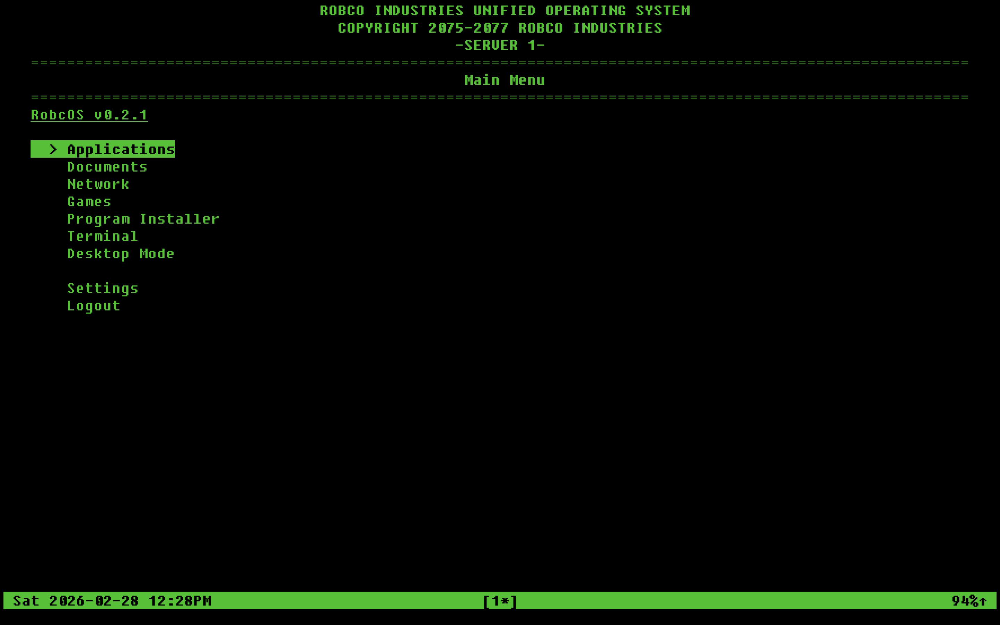
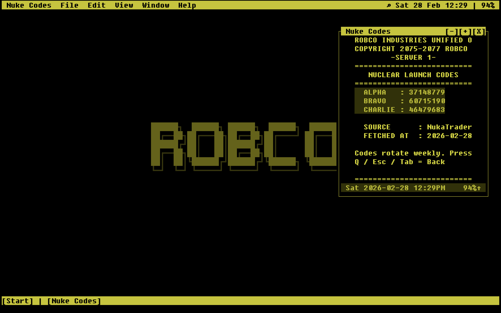

# RobCoOS

A Fallout-inspired terminal environment built with Rust, [ratatui](https://github.com/ratatui/ratatui), and [egui](https://github.com/emilk/egui).

RobCoOS is an application-layer shell experience, not a standalone operating system. It wraps your real terminal in a retro-computing interface with multi-user support, a full desktop mode, and a built-in app ecosystem.




**Version:** `0.4.0`

---

## Features at a Glance

| Category | Highlights |
|---|---|
| **UI Modes** | Terminal and Desktop, switchable at any time |
| **Sessions** | Up to 9 concurrent sessions with instant hot-key switching |
| **Users** | Multi-user login, per-user settings, per-user menus and documents |
| **Desktop** | Draggable windows, taskbar, Start menu, spotlight search, file manager |
| **Apps** | Text editor, file manager, document browser, installer, nuke codes viewer |
| **Auth** | Password, No Password, or Hacking Minigame login per user |
| **Theming** | Green, White, Amber, Blue, Light Blue, or custom RGB |

---

## Requirements

**Required:**
- Rust stable toolchain (`cargo`, `rustc`)
- `curl`

**Optional:**
- `epy` for EPUB/MOBI reading
- `vim` as an external editor
- `python3` plus `playsound` for enhanced audio
- `blueutil` on macOS for Bluetooth support

Audio works out of the box via platform fallbacks:
- macOS: `afplay`
- Linux: `aplay` or `paplay`
- Windows: PowerShell `Media.SoundPlayer`

---

## Build & Run

```bash
# Run the native shell in development mode
cargo run -p robcos-native-shell --bin robcos-native

# Build the native shell
cargo build --release -p robcos-native-shell --bin robcos-native

# Run the release build
cargo run --release -p robcos-native-shell --bin robcos-native

# Skip startup preflight checks
cargo run --release -p robcos-native-shell --bin robcos-native -- --no-preflight

# Validate the release workflow locally
make release-check
```

Pre-built binaries are on the [GitHub Releases](../../releases) page:

- **macOS**: universal native binary bundle in a zip
- **Linux**: x86_64 and aarch64 native bundles with `.desktop` entry and icon
- **Windows**: `robcos.exe` native bundle

Release assets ship the native shell only.

---

## First Login

If no users exist, a default admin account is created automatically:

| Field | Value |
|---|---|
| Username | `admin` |
| Password | `admin` |

> Change the default password immediately via **Settings -> User Management**.

New users, including the first admin, are prompted once after login to configure their **Default Apps**.

---

## Data Layout

All runtime data is stored relative to the executable:

```text
<base_dir>/
  settings.json
  users/
    users.json
    <username>/
      settings.json
      apps.json
      games.json
      networks.json
      documents.json
  journal_entries/
    <username>/
      YYYY-MM-DD.txt
```

---

## Documentation

See [`USER_MANUAL.md`](USER_MANUAL.md) for the full usage reference.

See [`docs/NATIVE_ROADMAP.md`](docs/NATIVE_ROADMAP.md) for the current native architecture and workspace split.

---

## Credits

- UI framework: [ratatui](https://github.com/ratatui/ratatui)
- Terminal/input backend: [crossterm](https://github.com/crossterm-rs/crossterm)
- GUI framework: [egui](https://github.com/emilk/egui) / [eframe](https://github.com/emilk/egui/tree/master/crates/eframe)
- PTY support: [portable-pty](https://github.com/wez/wezterm/tree/main/pty)
- Terminal emulation: [vt100](https://crates.io/crates/vt100)
- Utilities: [sysinfo](https://github.com/GuillaumeGomez/sysinfo), [chrono](https://github.com/chronotope/chrono)

Nuclear launch code data is sourced from community-maintained sources:
- [NukaCrypt](https://nukacrypt.com/)
- [NukaPD](https://www.nukapd.com/)
- [NukaTrader](https://nukatrader.com/)

This is an unofficial fan-made project. Fallout and all related names are property of their respective owners. This project is not affiliated with or endorsed by those entities.

This project was created with the help of AI-assisted development tools.
